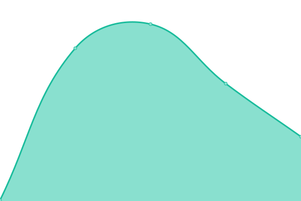
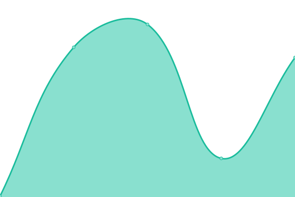

# [📈 Live Status](https://upptime.github.io/upptime): <!--live status--> **🟥 Complete outage**

This repository contains the open-source uptime monitor and status page for [Upptime](https://upptime.js.org), powered by [Upptime](https://github.com/upptime/upptime).

With [Upptime](https://upptime.js.org), you can get your own unlimited and free uptime monitor and status page, powered entirely by a GitHub repository. We use [Issues](https://github.com/upptime/upptime/issues) as incident reports, [Actions](https://github.com/minecraftchest1/ArsRoboticsStatus/actions) as uptime monitors, and [Pages](https://upptime.github.io/upptime) for the status page.

<!--start: status pages-->
<!-- This summary is generated by Upptime (https://github.com/upptime/upptime) -->
<!-- Do not edit this manually, your changes will be overwritten -->
<!-- prettier-ignore -->
| URL | Status | History | Response Time | Uptime |
| --- | ------ | ------- | ------------- | ------ |
|  [Main Site](https://arsrobotics.org) | 🟥 Down | [main-site.yml](https://github.com/minecraftchest1/ArsRoboticsStatus/commits/HEAD/history/main-site.yml) | 

 205ms
     
 | 

<a href="https://minecraftchest1.github.io/ArsRoboticsStatus/history/main-site">0.00%</a>
    

|  [Blog](https://wp.arsrobotics.org) | 🟥 Down | [blog.yml](https://github.com/minecraftchest1/ArsRoboticsStatus/commits/HEAD/history/blog.yml) | 

 125ms
     
 | 

<a href="https://minecraftchest1.github.io/ArsRoboticsStatus/history/blog">0.00%</a>
    

|  [Bucket](https://bucket.arsrobotics.org) | 🟥 Down | [bucket.yml](https://github.com/minecraftchest1/ArsRoboticsStatus/commits/HEAD/history/bucket.yml) | 

 205ms
     
 | 

<a href="https://minecraftchest1.github.io/ArsRoboticsStatus/history/bucket">0.00%</a>
    

|  [Status Page](https://status.arsrobotics.org) | 🟥 Down | [status-page.yml](https://github.com/minecraftchest1/ArsRoboticsStatus/commits/HEAD/history/status-page.yml) | 

 76ms
     
 | 

<a href="https://minecraftchest1.github.io/ArsRoboticsStatus/history/status-page">0.00%</a>
    

<!--end: status pages-->

[**Visit our status website →**](https://upptime.github.io/upptime)

## 📄 License

- Powered by: [Upptime](https://github.com/upptime/upptime)
- Code: [MIT](./LICENSE) © [Upptime](https://upptime.js.org)
- Data in the `./history` directory: [Open Database License](https://opendatacommons.org/licenses/odbl/1-0/)
